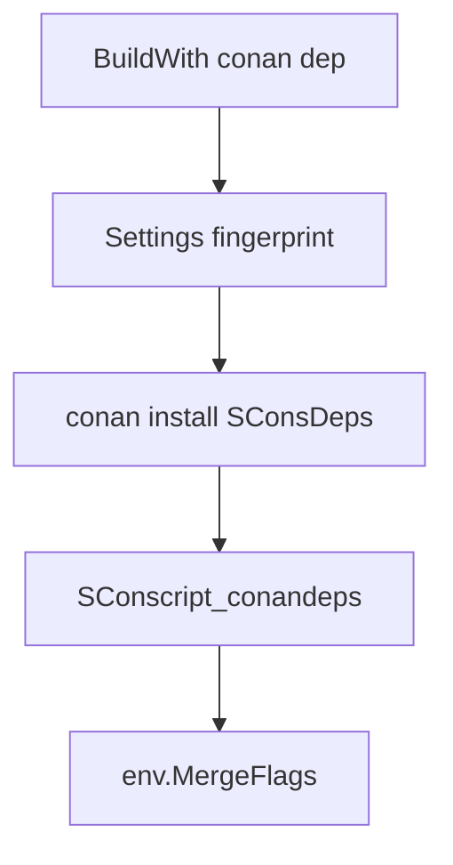

# Conan consumer integration for Cuppa (#29)

This document is the design and implementation plan for optional **Conan 2 consumer** support in Cuppa. It supersedes earlier sketches that led with PkgConfigDeps.

Related: [ROADMAP.md](ROADMAP.md) (Conan section), GitHub [#29](https://github.com/ja11sop/cuppa/issues/29).

## Goal

Let Cuppa projects consume Conan packages (for example `fmt`, OpenSSL, Boost binaries from ConanCenter) and apply compile/link flags through the existing `env.BuildWith(...)` path — **without** making Conan Cuppa’s orchestrator or replacing `location_dependency` / GitLab `package_dependency`.

Success looks like:

```python
# sconstruct
cuppa.run(
    default_dependencies = [
        cuppa.conan_deps( conanfile = 'conanfile.txt' ),
    ],
    ...
)

# or per-target
env.BuildWith( 'conan' )   # identity name from the factory
```

Cuppa runs `conan install` when needed (or reuses a fingerprint cache), loads Conan 2’s **`SConsDeps`** output, and merges flags into the SCons environment.

## Non-goals

| Non-goal | Reason |
|----------|--------|
| Conan as the build driver / required package manager | Cuppa remains the orchestrator |
| Replacing GitLab packages or location deps | Parallel supply chains |
| First-class Conan 1.x | Conan 2 only |
| Hosting/mirroring ConanCenter | Out of scope |
| Custom JSON “CuppaDeps” generator on the critical path | Only if SConsDeps proves insufficient |
| PkgConfigDeps as the default generator | Demoted to documented fallback / non-MVP |
| Cross-compilation profiles (build vs host) in MVP | Host-only Phase 1 |
| `tool_requires` / code generators (e.g. protobuf plugins) | SConsDeps historically weak; document limitation |
| Editable / local recipe workflows | Later |
| Conan-native BMI / `cxxflags` packaging | Cuppa stages Cuppa-native `modules/` + `module-map.json` (parity with GitLab); see [`CONAN_PUBLISH_PLAN.md`](CONAN_PUBLISH_PLAN.md) Phase 2b — **done** |

## Locked decision: primary generator is SConsDeps

Conan 2 provides [`conan.tools.scons.SConsDeps`](https://docs.conan.io/2/reference/tools/scons/sconsdeps.html). It writes `SConscript_conandeps` with `CPPPATH`, `LIBPATH`, `LIBS`, `CPPDEFINES`, `CCFLAGS`, `CXXFLAGS`, `LINKFLAGS`, `FRAMEWORKPATH`, `FRAMEWORKS`, and related keys, intended for `env.MergeFlags(...)`.

**Phase 1 uses `SConsDeps`.** Do not require `pkg-config` / pkgconf on the happy path (especially Windows).

Consumer load sketch:

```python
info = SConscript( os.path.join( install_dir, 'SConscript_conandeps' ) )
env.MergeFlags( info['conandeps'] )   # whole graph
# or env.MergeFlags( info['fmt'] )    # one require
```

PkgConfigDeps remains a documented fallback if a project already standardises on `.pc` files; it is **not** the MVP default. A custom CuppaDeps JSON generator is **out of scope** for the first PR unless the SConsDeps spike fails.



## How Cuppa dependencies work today (integration surface)

`env.BuildWith( names )` resolves each name in `env['dependencies']` and calls the dependency object with `(env, env, nest_level)` ([`cuppa/methods/build_with.py`](cuppa/methods/build_with.py)). Location and package deps implement `__call__` and mutate `CPPPATH` / `LIBPATH` / `LIBS` (and related).

`default_dependencies` are applied in `init_env_for_variant` during SConscript evaluation — **configure-time Python**, not a SCons builder node.

Implications for Conan:

1. **`conan install` runs during SConscript evaluation** when `BuildWith` (or default deps) applies the Conan dependency.
2. Use **process-safe caching** (file lock + “done” marker per fingerprint) so parallel SCons workers and multi-sconscript `BuildWith` do not race.
3. Identity should expose enough for **CreateVersion** (`version`, optionally `repository` / `revisions`) so `version.cpp` stays consistent with other deps (use package ref strings or `"N/A"` where Conan has no git revision).

## Recommended API (MVP)

### Primary: `conan_deps`

```python
cuppa.conan_deps(
    name = 'conan',                 # BuildWith identity (default 'conan')
    conanfile = 'conanfile.txt',  # or conanfile.py path
    # optional:
    # install_folder = None,        # default under download/cache roots
    # requires = None,              # if set without conanfile, write transient conanfile
    # options = None,               # pass-through / profile options
    # remote = None,
)
```

One dependency applies the **whole graph** via `info['conandeps']`. Prefer a single `conan_deps(...)` in `default_dependencies` rather than N installs for N packages.

### Sugar: `conan_dependency`

```python
cuppa.conan_dependency( 'fmt', requires = ['fmt/[*]'] )
```

Sugar over the same install machinery: writes a transient conanfile (or embeds requires) and **shares one fingerprint cache key** for the full requires set when multiple sugars would otherwise duplicate work. Prefer documenting `conan_deps(conanfile=...)` as the primary consumer API.

### Approach C (reuse): later / optional

```python
cuppa.conan_deps( generators_folder = '_conan' )  # skip install; load existing SConscript_conandeps
```

Useful when CI already ran `conan install`. Medium priority after MVP.

## Settings fidelity (Cuppa → Conan)

Map Cuppa toolchain / variant into Conan settings (and document gaps):

| Cuppa | Conan |
|-------|--------|
| variant `--dbg` / `--rel` / `--cov` | `build_type` (Debug / Release; coverage treated as Debug or documented mapping) |
| toolchain family (`gcc`, `clang`, `vc`) | `compiler` |
| toolchain version (`gcc15`, `clang21`, `vc145`) | `compiler.version` |
| dialect / `StdCpp` / `cxx2c` | `compiler.cppstd` |
| `--clang-stdlib=libc++` vs libstdc++ | `compiler.libcxx` |
| MSVC | `compiler.runtime`, toolset / version as Conan requires |
| host arch / OS | `arch`, `os` |
| `*:shared` | Conan options; MVP may use package defaults and allow override via conanfile |

**Phase 1 = host-only.** Cross / `target_architectures` and separate build vs host profiles are later.

## Runtime environment for `--test` / `--run`

Linking is not enough when packages install shared libraries. After install, apply runtime search paths from Conan’s run environment (prefer **VirtualRunEnv** output, or append package `bindirs` / `libdirs` to `env['ENV']`):

| Platform | Variables |
|----------|-----------|
| Windows | `PATH` |
| Linux | `LD_LIBRARY_PATH` (and `PATH` if needed) |
| macOS | `DYLD_LIBRARY_PATH` / `PATH` as appropriate |

Header-only packages still work via SConsDeps includes with empty or minimal `LIBS`.

## Cuppa flags: `--offline` / `--develop`

| Flag | Behaviour with Conan |
|------|----------------------|
| `--offline` | Do **not** call Conan remotes; fail clearly if install would need a download. Conan’s local cache may still be used. Not “ignore Conan”. |
| `--develop` | Does **not** substitute Conan packages with local develop paths (same honesty as GitLab `package_dependency`). |

Remotes / auth: document `CONAN_LOGIN_USERNAME` / token env vars; fail clearly on 401 / missing package.

Lockfiles: if `conan.lock` sits beside the conanfile, pass `--lockfile` / locked install; otherwise warn that builds are not pinned.

## conanfile and generators

- Prefer **`conanfile.txt`** for Cuppa-managed installs, with `[generators]` including `SConsDeps` (Cuppa may also pass `--generator=SConsDeps` on the CLI).
- If the project uses `conanfile.py` with a custom `generate()`, the consumer must still produce `SConscript_conandeps` (include `SConsDeps` in generators). Document “prefer conanfile.txt for Cuppa-managed install” or “must include SConsDeps”.
- **Link flag routing:** Cuppa distinguishes `LIBS` / `STATICLIBS` / `DYNAMICLIBS`; SConsDeps typically fills `LIBS`. MVP uses `MergeFlags` as Conan emits; richer routing is Phase 2.

## Security / trust

`conan install` executes recipe code from remotes — same class of risk as fetching location dependencies. Document a short warning in consumer docs.

## Implementation sketch

Suggested module: [`cuppa/build_with_conan.py`](cuppa/build_with_conan.py), exported from [`cuppa/__init__.py`](cuppa/__init__.py) as `conan_deps` / `conan_dependency`.

Responsibilities:

1. Resolve conanfile path (or write transient requires file).
2. Build a **fingerprint** from settings + conanfile content hash + options + lockfile id.
3. Choose install folder under Cuppa download/cache roots (e.g. `~/_cuppa` / project `_cuppa`).
4. If cache miss: run `conan install … --generator=SConsDeps` (plus VirtualRunEnv if used for runtime paths), with file lock.
5. `SConscript` load `SConscript_conandeps`; `env.MergeFlags(info['conandeps'])`.
6. Apply runtime `ENV` paths for tests/runs.
7. Expose `name`, `version` (and optional repo/revision fields) for CreateVersion.

## Testing

| Kind | Approach |
|------|----------|
| Unit | Mock install dir with a minimal `SConscript_conandeps` fixture; assert `MergeFlags` keys applied; fingerprint / offline behaviour |
| Integration | Linux CI installs Conan 2; `@pytest.mark.skipif` only when CLI missing locally |
| Windows CI | Conan not installed yet; document skip until a maintainable Conan+MSVC profile exists |
| Negative | Missing `conan` CLI → `StopError`; corrupt/missing `SConscript_conandeps` → `StopError` |

## Phased delivery

### Phase 0 — Spike (evidence) — **done**

Recorded 2026-07-30 with Conan 2.31.1 + gcc 15:

1. `conanfile.txt` with `fmt/11.1.4`, generators `SConsDeps` + `VirtualRunEnv`.
2. `conan install . -of=conan_install -s build_type=Debug -s compiler.cppstd=gnu20 --build=missing`.
3. Plain SCons and a tiny Cuppa project loaded `SConscript_conandeps`, `MergeFlags` (excluding `BINPATH`), compiled `#include <fmt/core.h>` hello — **no pkg-config**.
4. Settings used: `os=Linux`, `arch=x86_64`, `compiler=gcc`, `compiler.version=15`, `compiler.libcxx=libstdc++11`, `build_type=Debug`, `compiler.cppstd=gnu20`.
5. Note: per-require keys (e.g. `info['fmt']`) may have empty `LIBS`; aggregated `info['conandeps']` holds link libs — MVP always merges `conandeps`.

### Phase 1 — MVP in-tree — **done** (shipped in 1.3.0)

1. `cuppa/build_with_conan.py` + export from `__init__.py`.
2. Fingerprint + cache + lock; `BuildWith` apply; runtime ENV.
3. Unit fixture tests; docs on [`dependencies.adoc`](docs/modules/ROOT/pages/dependencies.adoc); CHANGELOG; ROADMAP IDs.
4. Integration scenarios under `test_conan` (Linux CI installs Conan 2).

### Phase 1b — Hardening follow-ups — **done**

1. Integration tests (`test_conan`): generators_folder, full install, shared `--test`, pip plugin, offline miss.
2. MSVC `compiler.runtime` / toolset version mapping; document `cxx2c` → `cppstd=26`.
3. Lockfile warning only on actual install (not every configure).
4. Example pip plugin package: `examples/conan_fmt_plugin`.
5. Modules/BMI consumer load after SConsDeps (`load_conan_packaged_modules`); publisher stages `modules/` — see publish plan Phase 2b.

### Phase 2 — Hardening (later)

- Richer `LIBS` / static / shared routing into Cuppa `STATICLIBS` / `DYNAMICLIBS`.
- Cross profiles; `tool_requires` story if feasible.
- Custom generator only if SConsDeps gaps remain.
- Docs + optional pip plugin example (`conan-docs-pip`).

- Custom JSON CuppaDeps generator
- PkgConfigDeps as default
- Cross-compilation profiles
- `tool_requires` / code generators
- Pip plugin example package (docs mention is enough)
- Making Conan mandatory or replacing GitLab/location deps

## Open questions (non-blocking for MVP)

1. Exact CreateVersion string format for a multi-package graph (single “conan” identity vs concatenated refs).
2. Whether coverage builds map to Conan `Debug` or a dedicated option.
3. How aggressively to honour an existing user `generate()` vs requiring `conanfile.txt`.
