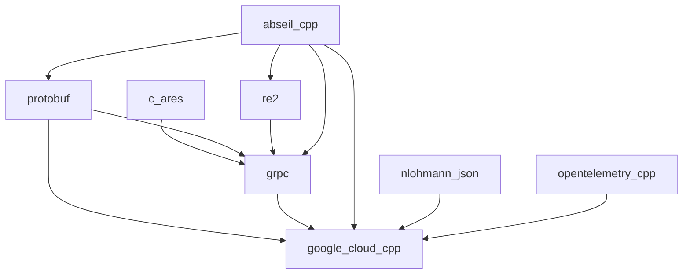

# CMake package prefixes and publisher API ergonomics

- **Status:** shipped
- **Related:** [`ROADMAP.md`](../../ROADMAP.md) — 1.11.0; [`cmake-drive-and-package-staging.md`](../plans/cmake-drive-and-package-staging.md); [`package-runtime-paths.md`](package-runtime-paths.md); [`download-extract.md`](download-extract.md); transitive manifests [`../plans/gitlab-package-transitive.md`](../plans/gitlab-package-transitive.md); run object lists [`../plans/run-default-dependency-objects.md`](../plans/run-default-dependency-objects.md)
- **Updated:** 2026-09-14
- **Impact:** `minor`

## Problem

Publisher sconscripts still hand-wired BuildWith package dirs, tool paths, concrete
manifest versions, and local Ninja discovery:

```python
protobuf = env.BuildWith( 'protobuf' )
protobuf_dep = protobuf.package()
protobuf_package_dir = protobuf_dep.package_dir()
protobuf_version = protobuf_dep.version()
cmake_prefix = cmake_prefix_path( otel_dir, grpc_dir, protobuf_dir )
protoc = os.path.join( protobuf_package_dir, 'bin', 'protoc' )
cmake_generator = 'Ninja' if shutil.which( 'ninja' ) else None
```

Runtime ENV and includes already came from `BuildWith` / auto-enable. The remaining
ceremony was **CMake prefix / tool paths**, **manifest pins**, and **generator discovery**.

## Settled decisions

| Topic | Decision |
|-------|----------|
| Lookup | Resolve via `env.BuildWith(name)` (cached). Accept name string or dependency object (`name()`). |
| Methods | `env.PackageDir` / `PackageBin` / `PackageLib` / `PackageVersion` / `CMakePrefixPathFor`. Free functions kept under `cuppa.package_managers.package_paths` / `cmake_prefix_path_for` for unit tests. |
| Name ↔ slug | Prefer convention **(b)**: `name` only → `package = name.replace('_','-')`; `package` only → reverse; both → as-is; bare string = Cuppa **name**. Escape hatch: pass both when the slug is not that transform (e.g. Boost). Do not force name == slug **(a)** — fights GitLab hyphens and snake_case Python ids. |
| Manifest | Omit `version` (fill from BuildWith at publish); omit/`''` registry → `same`; bare strings / mixed lists. Manifest still stores concrete `name` + `package` after normalisation. |
| Indent | 4-space semantic indents for dicts/lists; deeper only for line continuations. |
| Generator | `generator=None` → Ninja if `ninja` on PATH; `False` → omit `-G`; string → exact. Shared by Option B argv helpers and `env.CMakeConfigure`. |
| `cuppa.run` objects | Already shipped (`run_list_names` / preferred `import_dependencies` / `auto_enable_dependencies`). Not re-implemented here. |
| Refuse | Auto-injecting `CMAKE_PREFIX_PATH` into every `CMakeConfigure` without asking (order-sensitive / too magical). |

### Name ↔ slug rationale

Clearpool groups/repos/variables use snake_case; GitLab package slugs often use hyphens
(`opentelemetry_cpp` / `opentelemetry-cpp`). Deriving the missing field keeps publisher
`dependencies=['opentelemetry_cpp']` honest without inventing a second vocabulary where
`package=` means BuildWith name.

### Generator flow

```mermaid
flowchart TD
  call["env.CMakeConfigure(...)"]
  gen{"generator arg"}
  call --> gen
  gen -->|"string"| exact["-G that string"]
  gen -->|"False"| omit["no -G"]
  gen -->|"None / omitted"| auto{"ninja on PATH?"}
  auto -->|yes| ninja["-G Ninja"]
  auto -->|no| omit
```

## Shipped shape

```python
publisher = GitlabPackagePublisher(
    env, …,
    dependencies = [
        'protobuf',
        'grpc',
        'opentelemetry_cpp',
    ],
)

cmake_out = env.CMakeConfigure(
    extracted_release,
    working_dir = extraction_folder,
    source_dir = '.',
    build_dir = build_output,
    install_prefix = str( install_location ),
    c_compiler = True,
    cxx_standard = False,
    extra_defines = {
        'CMAKE_PREFIX_PATH': env.CMakePrefixPathFor(
            'opentelemetry_cpp', 'grpc', 'protobuf',
        ),
        'Protobuf_PROTOC_EXECUTABLE': env.PackageBin( 'protobuf', 'protoc' ),
        'GOOGLE_CLOUD_CPP_GRPC_PLUGIN_EXECUTABLE': env.PackageBin(
            'grpc', 'grpc_cpp_plugin',
        ),
        # …
    },
)
```

Private adopt: protobuf, gRPC, OpenTelemetry C++, and google-cloud-cpp
publishers (4-space indent; no local `which('ninja')`; bare dep names / objects
where applicable).

## Progress snapshot

| Item | State |
|------|--------|
| Paths + version fill (free functions) | Done |
| Methods + name/object resolve | Done |
| Name ↔ slug + bare-string deps | Done |
| Default Ninja generator | Done |
| Unit tests / Antora / CHANGELOG | Done |
| Private adopt (protobuf, gRPC, OTel, google-cloud-cpp) | Done |

## Out of scope / follow-ons (not blocking this plan)

- Further cmake-drive items (archive progress, #209 in-place packaging, publish-side CLI pins) remain on [`cmake-drive-and-package-staging.md`](../plans/cmake-drive-and-package-staging.md).

## Prove-out soak — google-cloud-cpp stack (project D)

Use the public **google-cloud-cpp** packaging story as the end-to-end check that
Option B/C methods, `CMakePrefixPathFor`, bare BuildWith names, RPATH helpers,
and GitLab package republish actually compose — exercised in the private
**packages / publisher tree** (**project D**). Do not put private registry hosts
or absolute paths in tracked Cuppa files; cite OSS package names and pins only.

### Why bottom-up

Protobuf and google-cloud-cpp both `find_package(absl CONFIG REQUIRED)`. gRPC
uses `gRPC_*_PROVIDER=package` for Abseil, c-ares, and RE2. Pointing only the
top of the stack at a Cuppa Abseil while lower packages were built against the
distro Abseil breaks ABI. Rebuild and republish **upward** so every shared
library shares the same Cuppa prefixes.



### Package set (pins match cloud-cpp packaging docs where they name one)

| Cuppa name / slug | Pin (soak) | Role |
|-------------------|------------|------|
| `abseil_cpp` / `abseil-cpp` | `20250814.2` | Shared by protobuf, gRPC, RE2, cloud-cpp |
| `protobuf` | `36.1` | Rebuild against Cuppa Abseil |
| `c_ares` / `c-ares` | `1.34.5` | gRPC `gRPC_CARES_PROVIDER=package` |
| `re2` | `2025-11-05` | gRPC + Abseil |
| `grpc` | `1.84.0` | Rebuild against Cuppa Abseil / c-ares / RE2 / protobuf |
| `nlohmann_json` / `nlohmann-json` | `3.12.0` | cloud-cpp `find_package(nlohmann_json)` |
| `crc32c` | `1.1.2` | Packaged for completeness; cloud-cpp **v3** uses an internal CRC helper and does not `find_package(Crc32c)` |
| `opentelemetry_cpp` / `opentelemetry-cpp` | `1.28.0` | Already Cuppa (`WITH_STL=CXX17`); no Abseil rebuild this pass |
| `google_cloud_cpp` / `google-cloud-cpp` | `3.9.0` | Top of stack |

Leave as system: OpenSSL, zlib, curl (≥ **8.7.1** for cloud-cpp 3.9), nghttp2, systemd.

### Publisher wiring checklist

1. **Leaf packages** — Abseil, c-ares, nlohmann-json, crc32c publishers; RE2 BuildWiths Abseil. Publish each.
2. **protobuf** — `import`/`auto_enable` + publisher `dependencies` + `CMakePrefixPathFor('abseil_cpp')` + RPATH `PackageLib('abseil_cpp')`. Publish.
3. **gRPC** — same for `abseil_cpp`, `c_ares`, `re2`, `protobuf` (keep existing `gRPC_*_PROVIDER=package`). Publish against the new protobuf.
4. **google-cloud-cpp** — add `abseil_cpp` + `nlohmann_json` beside protobuf / grpc / opentelemetry_cpp; keep OTel **first** on `CMAKE_PREFIX_PATH` so a non-STL distro OTel is not preferred. Publish against the new protobuf/gRPC.

### Progress (project D)

| Step | State |
|------|--------|
| Leaf publishers (Abseil, c-ares, RE2, nlohmann-json, crc32c) | Done (published) |
| protobuf → Cuppa Abseil | Done (published) |
| gRPC → Cuppa Abseil / c-ares / RE2 | Done (published) |
| google-cloud-cpp → Cuppa Abseil / nlohmann-json | Done (**3.9.0** built and published; manual bottom-up) |
| Small compiled leaves (`fmt`, `date`) as final Option C soak | Done — publishers built/published (`12.2.0` / `3.0.5`); `business_rules` switched to `package_dependency` |
| Cuppa PR [#294](https://github.com/ja11sop/cuppa/pull/294) (helpers this soak uses) | Open / green |
| Cascade `--build-and-publish-dependencies` | Deferred — [`package-build-publish-deps.md`](../plans/package-build-publish-deps.md) |

**Soak friction noted:** gRPC’s in-tree `grpc_cpp_plugin` needs
`CMAKE_BUILD_WITH_INSTALL_RPATH=OFF` so build RPATH keeps `$ORIGIN` next to
`libgrpc_plugin_support`. Turning install-RPATH-during-build on breaks codegen
(status 127 / missing `.so`). Leave that flag for packages whose tools only run
from the install prefix (e.g. protobuf `protoc`).

**Soak friction noted:** same-version package republish does not invalidate the
local archive/extract cache (existence-only). Until
[`package-download-refresh.md`](../plans/package-download-refresh.md) ships,
purge/wipe (or plant) after each republish before rebuilding dependents.

Slice id on the drive plan: `cmake-pkg-cloud-soak`.
