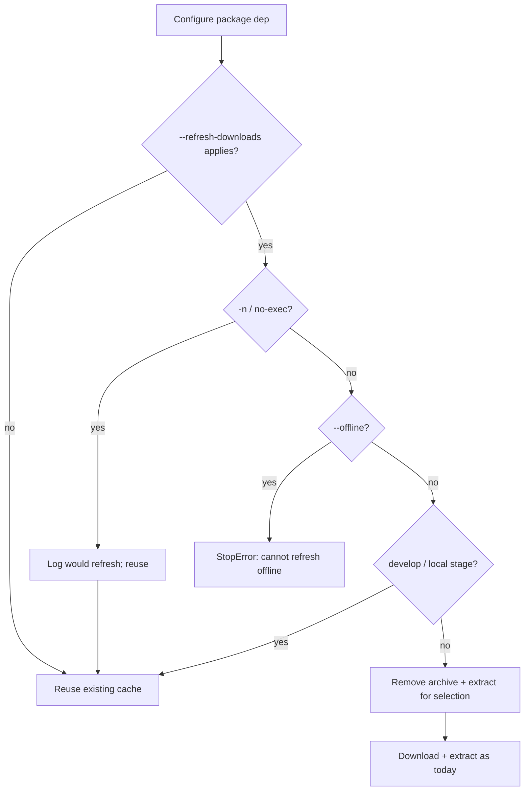

# Plan: Refresh package downloads after same-version republish

- **Status:** shipped
- **Related:** [#296](https://github.com/ja11sop/cuppa/issues/296); [#342](https://github.com/ja11sop/cuppa/pull/342); [`ROADMAP.md`](../../ROADMAP.md) — storage (`package-download-refresh`); [`package-build-publish-deps.md`](package-build-publish-deps.md) (cascade nest-publish refreshes tip consume after upload — orthogonal); [`removal-options.md`](../plans/removal-options.md) (purge/wipe vocabulary); [`gitlab.py`](../../cuppa/package_managers/gitlab.py) `GitlabPackageDependency`
- **Updated:** 2026-09-28
- **Impact:** `minor` (new opt-in CLI behaviour)

## Problem

GitLab package **consume** caches by package name + version + toolchain/OS stem:

| Layer | Typical path shape | Skip condition today |
|-------|--------------------|----------------------|
| Archive | `downloads_root/packages/<pkg>/<ver>/<stem>.tar.gz` | File **exists** → never re-download |
| Extract | `dependencies_root/<tool_variant>/<pkg>/<ver>/` | `include/` **exists** → never re-extract |

There is **no** registry freshness check (no `HEAD` / `If-Modified-Since` / ETag).
`--offline` only refuses when the archive is missing; it does not validate currency.

**Soak pain (project D / google-cloud-cpp stack):** republish `protobuf/36.1`
(same version, new contents after rebuilding against Cuppa Abseil). A dependent
publisher (gRPC) that already has that archive + extract on disk keeps building
against the **old** bits. Cleaning the dependent’s `_build` does not help.
Operators must manually `--purge-dependencies=…` / `--wipe-dependencies=…`
(or delete cache paths) before the next online configure.

That workflow is correct but easy to forget mid-stack republish.

## Intent

Add an **opt-in** way to say: for this configure, treat declared package
dependencies’ cached archives (and their extracts) as stale — re-fetch from the
registry and re-extract — without requiring a separate purge/wipe dance.

Not a silent default. Not automatic GC ([`ROADMAP` storage-gc](../../ROADMAP.md)
out of scope). Complements purge/wipe; does not replace them.

## Current behaviour (authoritative)

From `GitlabPackageDependency` construction:

1. Resolve preferred/existing archive under `downloads_root/packages/…`.
2. If **not** `--offline` and archive path **missing** → download first available stem.
3. If extract `include/` **missing** and archive present → extract.
4. Else → `Using package […] from […]` (reuse extract as-is).

`--develop` with a develop path skips download/extract for that dependency.

Publish-side staging refresh (`staging_tree_needs_refresh` / #209) and cascade tip
consume refresh after nested **upload** are **orthogonal** — those are not this flag.

## Settled decisions (2026-09-27)

| Topic | Decision |
|-------|----------|
| Flag name | **``--refresh-downloads``** (pairs with ``--list-downloads``; scope in help/Antora) |
| Optional value | ``nargs='?'``: bare / no value → all **project-used GitLab package** deps for this configure; ``=a,b`` → Cuppa dependency **names** only |
| Unknown names in ``=LIST`` | **Refuse** after sconscript/package construction if any listed name was never seen as a GitLab package dep (actionable Options Error / StopError) |
| When | Configure-time inside ``GitlabPackageDependency`` construction, before reuse of archive/extract |
| What | For each selected dep: remove matching archive(s) under the package version cache dir + the extract tree for the **current** toolchain/variant selection, then download + extract as today |
| ``--offline`` | **Refuse** when the flag applies (cannot refresh without network) |
| ``--develop`` / prefix develop | **Skip** refresh for that dep (local tree / prefix is source of truth) |
| Publisher-shaped develop (stage path) | **Skip** when tip consumes local stage (same as develop skip) |
| Location / Conan / Boost source | Out of scope for v1 |
| Conditional vs force | **Force** re-download in v1 (no HEAD skip). Later slice: optional If-Modified-Since |
| Purge / wipe | Unchanged storage maintenance; refresh may reuse path-deletion helpers |
| ``-n`` / ``--no-exec`` | **Skip** drop+fetch (log that refresh would apply); SCons dry-run still configures — do not delete caches under dry-run |
| Nested cascade sessions | Nested argv may inherit the tip flag; that is OK (nested tips that consume packages refresh their own caches). No special drop required for v1 |
| Docs | Antora Managing + CLI; CHANGELOG; warn about same-version republish soaks |

Rejected spellings retained for history: ``--refresh-dependent-downloads``,
``--refresh-package-downloads``, ``--refetch-packages``, ``--update-package-downloads``,
``--invalidate-package-cache``, ``--refresh-dependencies``. Prefer renaming to
``--refresh-package-downloads`` only if review finds ``--refresh-downloads`` too broad
before the named release — cheap while ``.dev``.

## Work slices

| ID | Deliverable | Target |
|----|-------------|--------|
| `pkg-dl-refresh-plan` | Plan + ROADMAP / design index | Done |
| `pkg-dl-refresh-names` | Settle flag spelling + `=LIST` grammar | **Settled** 2026-09-27 |
| `pkg-dl-refresh-impl` | Option + GitlabPackageDependency hook; unit tests; unknown-name audit | Done on master [#342](https://github.com/ja11sop/cuppa/pull/342) |
| `pkg-dl-refresh-docs` | Antora Managing / CLI; CHANGELOG | Done on master [#342](https://github.com/ja11sop/cuppa/pull/342) |
| `pkg-dl-refresh-conditional` | Optional If-Modified-Since / skip unchanged | Later |

## Acceptance

1. Same-version republish of package A, then configure project B with the refresh
   flag, yields A’s new archive contents under dependencies_root without a prior
   manual purge.
2. Without the flag, behaviour unchanged (existence-only cache).
3. `--offline --refresh-downloads` fails clearly.
4. Name list errors are actionable; bare flag does not touch unrelated downloads.
5. Antora documents the flag next to list/purge/wipe and warns about same-version
   republish soaks.

## Out of scope

- Changing default cache policy to always check the registry.
- Auto-refresh on every online build.
- Content-addressed archive filenames (would also fix the pain; larger change).
- Publish-side “bump version on every rebuild” policy (operator choice).
- Location HTTP archive refresh (separate flag or scope later).
