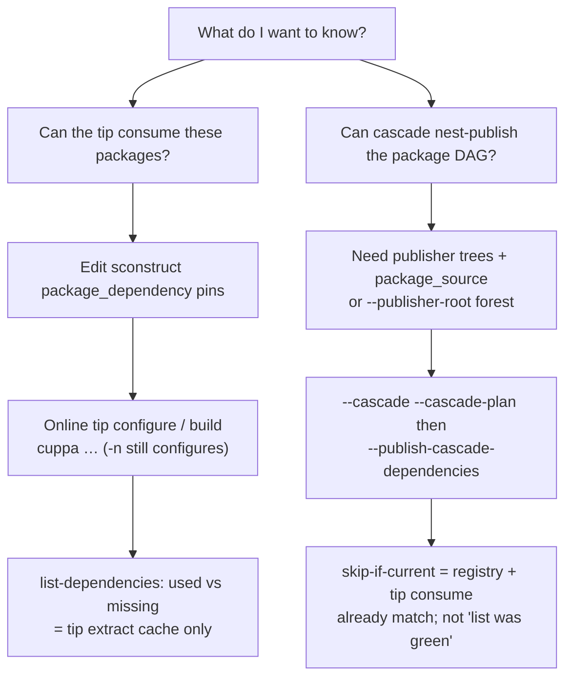

# Plan: Cascade / consume UX soak notes (order_matcher)

- **Status:** proposal
- **Related:** [`archive/package-build-publish-deps.md`](../archive/package-build-publish-deps.md); [`cascade-enable-rename.md`](cascade-enable-rename.md); [`console-stop-error-reporting.md`](console-stop-error-reporting.md); Antora [`dependencies/publishing/cascade.adoc`](../../docs/modules/ROOT/pages/dependencies/publishing/cascade.adoc), [`dependencies/managing/list-dependencies.adoc`](../../docs/modules/ROOT/pages/dependencies/managing/list-dependencies.adoc), [`dependencies/using/packages.adoc`](../../docs/modules/ROOT/pages/dependencies/using/packages.adoc); version-ranges soak context [`gitlab-package-version-ranges.md`](gitlab-package-version-ranges.md)
- **Updated:** 2026-10-10
- **Impact:** `none` for this capture; follow-on code slices likely `patch` / `minor`

## Problem

A new-user soak on a consume-only tip (`order_matcher`) while validating package
pins (including `version='>=…'`) surfaced several confusions that are **easy to
hit** and **hard to unlearn** from today’s messages alone. Most are not bugs in
skip-if-current; they are **vocabulary and workflow** gaps.

The central mix-up:

| Question the operator meant | Question they accidentally asked |
|-----------------------------|----------------------------------|
| **Can this tip build against the packages I declared?** (consume) | **Can I cascade nest-publish those packages?** (publish DAG) |

`--list-dependencies` showed tip GitLab rows as **missing**. That looked like
“the packages aren’t available,” so the operator reached for `--cascade` /
`--cascade-plan` / `--collect-cascade` / `--clone-publishers`. In fact the pins
were already **in the registry**; “missing” meant **no tip-local consume extract**
for the selected toolchain stem. An online tip resolve later downloaded them;
cascade then correctly reported **skipped (current)** with no nest build.

So: list said “missing” when the packages were **not** absent from the world —
only absent from this machine’s tip consume cache. Cascade was the wrong tool
for the first question.

## Intent

1. Capture soak findings so agents/humans do not rediscover them only by pain.
2. Specify **documentation** that answers the two questions separately.
3. List small product follow-ons (option-compat, remedies, nest variant default)
   without blocking the version-ranges PR.

## Two questions (teach this first)

### A. Tip consume (“can I build with these packages?”)

1. Declare / adjust `package_dependency(…)` (exact, `>=…`, `latest`).
2. Run an **online** tip configure or build (SCons `-n` still configures and can
   download; it does **not** mean “cascade plan”).
3. Use `--list-dependencies` to see whether tip **extracts** are present for the
   active toolchain. **Missing** ≠ “not in registry.”
4. Tip `--dbg` still consumes **rel** package extracts
   (`<packages> = …/gcc16_rel_…`). That is expected.

### B. Cascade publish (“can I nest-build/publish the DAG?”)

1. Requires resolvable **publisher trees** (`package_source` URL,
   `--publisher-root` forest, or `--clone-publishers` when a URL is declared).
2. Review with `--cascade --cascade-plan` (not `-n`).
3. Execute with `--cascade --publish-cascade-dependencies` (consume tip) or
   `--publish-package --cascade` (publisher tip).
4. **skipped (current)** means registry + tip consume already match for that
   pin/toolchain — nest would be a no-op. Cloning a publisher tree alone does
   not upload and does not by itself clear tip “missing.”

## Soak findings (concrete)

### 1. “Missing” vs registry vs publisher tree

| Signal | Means | Does **not** mean |
|--------|--------|-------------------|
| list **missing** (used GitLab row) | No tip extract (and often no matching local archive) for that identity under dependencies/downloads roots | Package absent from GitLab; cascade required |
| Cascade error: no `package_source` / no publisher tree | Cannot place a nest working tree | Tip cannot download from registry |
| Cascade **skipped (current)** | Registry object + tip consume already agree | Operator must have nest-built just now |
| Unused section has `gcc15_…/fmt` while used shows `gcc16_…` missing | Sibling toolchain extract exists; tip wants another stem | Package never published |

Docs should use a small table like this on list-dependencies **and** on the
cascade page (cross-linked).

### 2. Wrong tool after “missing”

Operator path observed:

1. list → missing fmt/date for `gcc16_rel`
2. `--cascade --cascade-plan --offline` → publisher-tree errors (no
   `package_source`)
3. `--collect-cascade` / `--clone-publishers` thrash (clone cannot invent a URL)
4. Add `package_source`, clone publishers → plan green
5. `--publish-cascade-dependencies` → **11 skipped (current)**; tip build runs

Better path for the **consume** question:

1. Edit pins
2. `cuppa -Q --dbg --toolchains=gcc16 …` (or `-n` for configure-only)
3. Re-list; missing should clear once registry download succeeds
4. Only then consider cascade if the goal is republish/rebuild package sources

### 3. Finish-line remedy over-pitches `--clone-publishers`

When the hard error is **no `package_source`**, the footer still says “pass
`--clone-publishers` to fetch the ones with a URL package_source.” Accurate for
URL-backed nodes; **misleading** when the failing nodes have no URL. Split
remedies:

- No URL → add `package_source` **or** `--publisher-root` to a forest that
  already holds `{name}` / `{package}` / one-level nest
- Has URL, no tree → `--clone-publishers` (with collect/plan/publish companion)

### 4. `-n` + `--cascade`

Settled earlier: **not** an alias for `--cascade-plan` (SCons `-n` ≠ “show DAG
and stop”). Refuse stays. Follow-on:

- Detect the combination **before** the long tip resolve walk when possible
- Remedy: explicit **did you mean `--cascade-plan`?**
- Fits [`console-stop-error-reporting.md`](console-stop-error-reporting.md)
  (option-compat registry + guided trees)

### 5. Long tip resolve on every plan/collect attempt

Even `--cascade-plan` pays full location update/resolve for dozens of repos.
Ideas (open):

| Idea | Sketch | Caution |
|------|--------|---------|
| `--skip-resolve` / “plan-only locations” | Skip location fetch/update; use on-disk trees only for plan | Must not silently lie about tip readiness |
| Narrower than `--offline` | Offline also blocks registry latest / package list | Separate knobs may be clearer |
| Cache “resolve already done this session” | Less general | Hard across process boundaries |

Document today: `--offline` freezes network but still **walks** locations; it is
not a cheap plan mode.

### 6. Nest variant vs tip `--dbg`

Today nested argv **forwards tip flags**, including `--dbg`. Tip dbg builds
already consume **rel** package extracts. Product lean from soak:

- Default nested publish/build-deps to **`--rel`** (published package identity)
- Tip `--dbg` / `--cov` / … do not change nest stems unless opted in
- Opt-in name TBD: `--cascade-dbg` / `--dbg-cascade`

Document the current forward behaviour until that lands so operators are not
surprised on the first non-skip nest.

### 7. Version ranges (incidental)

Tip `fmt` with `version='>=12.2.0'` participated in this soak; list/resolve used
a concrete `12.2.0`. No new ranges bug found here — keep tracking on
[`gitlab-package-version-ranges.md`](gitlab-package-version-ranges.md) / #364.

## Documentation enhancements (priority)

| Where | Add |
|-------|-----|
| [`list-dependencies.adoc`](../../docs/modules/ROOT/pages/dependencies/managing/list-dependencies.adoc) | **Missing** = tip-local extract/archive gap; unused sibling stems; “try online tip build before cascade”; link to cascade only for publish DAG |
| [`cascade.adoc`](../../docs/modules/ROOT/pages/dependencies/publishing/cascade.adoc) | “Two questions” section (consume vs cascade); missing ≠ needs cascade; skip-if-current vs list missing; clone vs download; `-n` refused + did-you-mean plan; nest variant / tip dbg note |
| [`packages.adoc`](../../docs/modules/ROOT/pages/dependencies/using/packages.adoc) / using gitlab | After declaring packages: first prove tip consume; cascade is optional republish |
| Cascade plan finish-line / Options Error | Copy changes in code + regenerate samples when remedies split |
| Agent-oriented blurb | Short “if list says missing, do X not Y” in Antora or `AGENTS.md` pointer to cascade consume section |

## Product follow-ons (later slices)

| ID | Work | Priority |
|----|------|----------|
| `opt-compat-early` | Register incompatible option sets; fail before resolve when safe; guided tree | Medium — ties to console-stop-error |
| `cascade-n-did-you-mean` | `--cascade` + `-n` → did you mean `--cascade-plan`? | Low / quick once early compat exists |
| `cascade-remedy-split` | Finish-line / node errors distinguish no-URL vs URL-needs-clone | Medium |
| `cascade-nest-rel` | Default nest `--rel`; opt-in dbg nest flag | Medium |
| `skip-resolve` | Explore cheap plan/collect without full location update | Low — design first |

## Non-goals

- Changing skip-if-current semantics
- Making `-n` mean cascade-plan
- Auto-cascade when list shows missing
- Implementing version-ranges here

## Progress

| Item | Status |
|------|--------|
| Soak capture + two-questions framing | Done — this proposal |
| Antora / remedy / nest-rel / opt-compat slices | Not started |
