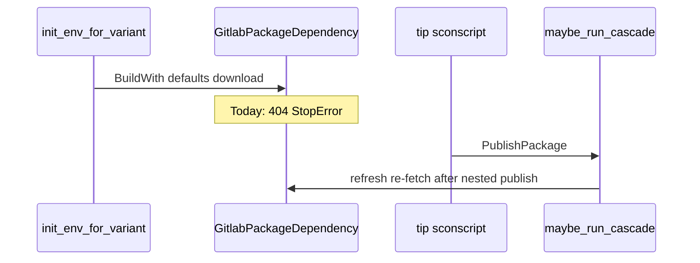

# Plan: Cascade defer-404 for first publish (§6 / Slice F)

- **Status:** in progress
- **Related:** [#297](https://github.com/ja11sop/cuppa/issues/297); parent [`package-develop-local.md`](package-develop-local.md) §6; cascade [`package-build-publish-deps.md`](package-build-publish-deps.md); [`ROADMAP.md`](../../ROADMAP.md) — `package-develop-local`; merged [#316](https://github.com/ja11sop/cuppa/pull/316); cite/archive [#320](https://github.com/ja11sop/cuppa/pull/320)
- **Updated:** 2026-09-21
- **Impact:** `minor`

## Problem

Tip `BuildWith(default_dependencies)` runs in [`init_env_for_variant`](../../cuppa/methods/build_with.py) **before** the sconscript body, so [`GitlabPackageDependency.__init__`](../../cuppa/package_managers/gitlab.py) downloads **before** [`PublishPackage` → `maybe_run_cascade`](../../cuppa/package_managers/gitlab.py). Cascade already refreshes the tip consume cache after each nested publish ([`refresh_package_consume_cache`](../../cuppa/package_managers/package_cascade.py)); the gap is the early fatal registry `404`.



## Settled decisions

| Question | Choice |
|----------|--------|
| Approach | **3 now** (defer 404 for cascade-bound packages); approach 2 (lazy fetch) remains later |
| When deferral is allowed | Tip session only (`not` nested), and `--build-and-publish-dependencies` |
| Which packages | **Exactly cascade-eligible tip deps**, not every 404: tip can resolve a publisher for that pin (`package_source` / publisher-shaped `develop=` / tip `cuppa-publish.json` edge with a source). Pure registry-only deps keep today’s fatal 404 |
| Deferred behaviour | Construct the dependency, keep the usual `_package_dir` extract path, **do not** raise; log that fetch waits on cascade |
| After cascade | Existing invalidate + re-fetch; if a deferred pin is still missing, **StopError** naming the package and that cascade did not produce it |
| Plan / collect / update-stop | Same deferral (pre-sconscript BuildWith still runs); no build follows for stop-before-build modes |
| Offline | Unchanged refusal when no local archive/stage |
| Slice label | **F** — first-publish defer-404; impact `minor` |

Helpers live in [`package_cascade.py`](../../cuppa/package_managers/package_cascade.py): `tip_package_is_cascade_eligible`, `register_deferred_cascade_fetch`, `audit_deferred_cascade_fetches`. Deferral is wired in [`gitlab.py`](../../cuppa/package_managers/gitlab.py) on total-miss `DownloadError` when `is_http_not_found`.

## Soak target — project D

Operator goal: from the tip publisher tree, one cascade run that leaves **the tip package and every package in its publish DAG** in the registry (matching toolchain identity).

Tracked cuppa docs/plans use **project D** only; real forest path stays in gitignored `design/INTERNAL_PROJECTS.local.md`.

### Why a cold plan can show only tip-direct nodes

[`build_cascade_graph`](../../cuppa/package_managers/package_cascade.py) **does** walk transitive edges from each resolved publisher’s `cuppa-publish.json`. When a node is only a *planned clone* (`_publisher_dir is None`), the walk **stops** there — so a cold `--cascade-plan` without local trees lists tip-direct deps only.

After trees resolve, a deep tip expands (shape): tip-direct leaves plus children such as c-ares / re2 under grpc — typically **~7 nested packages** + tip for the google-cloud-cpp-shaped stack.

### Collect-cascade evidence (2026-09-20)

Cold start with `--clone-publishers --collect-cascade` (no build/upload) resolved the full tip-direct set and cloned every missing publisher under `~/.cuppa/publishers`:

```
Cascade plan: google-cloud-cpp [==3.9.0] (this package) with 7 package dependencies:
  1/7 abseil_cpp, 2/7 c_ares, 3/7 nlohmann_json, 4/7 opentelemetry_cpp,
  5/7 protobuf, 6/7 re2, 7/7 grpc
  then google-cloud-cpp [==3.9.0] from this tree

--collect-cascade: 7 publisher trees collected, 7 publisher trees newly cloned;
nothing was built, published, or uploaded.
```

That confirms the **clone + DAG visibility** half of the soak.

### Full publish soak (2026-09-21) — succeeded

`--build-and-publish-dependencies --publish-package` (without `--parallel`; see
[#317](https://github.com/ja11sop/cuppa/issues/317) / [#319](https://github.com/ja11sop/cuppa/pull/319))
completed the tip google-cloud-cpp package after nested leaf-first publishes.
Tip defer-404 held; no nested-parent 404 expansion of Slice F was required.

### Recommended soak commands

Prefer the **default cold-start path** (`--clone-publishers` into `~/.cuppa/publishers`), not a pre-planted `--publisher-root` forest:

```sh
# 1) Collect + clone (done for project D — see evidence above)
cuppa -D --rel --toolchains=gcc15 \
  --build-and-publish-dependencies --collect-cascade --clone-publishers -Q

# 2) Optional: re-plan with trees on disk
cuppa -D --rel --toolchains=gcc15 \
  --build-and-publish-dependencies --cascade-plan -Q

# 3) Full cascade — Slice F lets tip BuildWith survive missing archives
cuppa -D --rel --toolchains=gcc15 \
  --build-and-publish-dependencies --publish-package --clone-publishers
```

### Soak notes (not Slice F scope, but will bite)

- Nested sessions are leaf-first and upload as they go; parents should fetch already-published leaves from the registry. §6 is primarily the **tip** pre-sconscript gate. Project D full publish did **not** hit nested parent 404s; do not expand F to nested defer unless a later soak proves it.
- Tip auto-enables its direct package deps → those pins hit the defer path on a virgin registry/toolchain.
- **`--parallel` + `--publish-package`:** nested abseil failed after “Package … created” with `Source '….tar.gz' not found` for `.published` — archive is a side effect of `.packaged`, not declared to SCons. Workaround used for this soak: omit `--parallel`. Fix: [#317](https://github.com/ja11sop/cuppa/issues/317) / [#319](https://github.com/ja11sop/cuppa/pull/319).

## Implementation checklist

1. Eligibility helper — `tip_package_is_cascade_eligible` (**done**)
2. Defer in `gitlab.py` + register deferred keys (**done**)
3. Post-cascade `audit_deferred_cascade_fetches` (**done**)
4. Unit tests for eligible / ineligible / audit (**done**)
5. Antora one-paragraph note under cascading publishes (**done**)
6. Project D full publish soak (**done** 2026-09-21)

## Non-goals

- Full lazy fetch (approach 2)
- Pre-sconscript cascade without `PublishPackage`
- Location L3 / `StageLocationDevelop`
- Slice E prefix migration
- Changing publisher-root nested lookup heuristics (secondary soak only)

## Progress snapshot

| Item | State |
|------|--------|
| Settled decisions in parent plan §6 | Done |
| Code: eligibility + defer + audit | Done on [#316](https://github.com/ja11sop/cuppa/pull/316) |
| Unit tests + Antora | Done |
| Collect-cascade soak (7/7 cloned) | Done |
| Full publish soak (tip + 7 nested) | **Done** 2026-09-21 |
| Merged to master | **Done** [#316](https://github.com/ja11sop/cuppa/pull/316) |
| Cite / move to `design/archive/` | [#320](https://github.com/ja11sop/cuppa/pull/320) |
