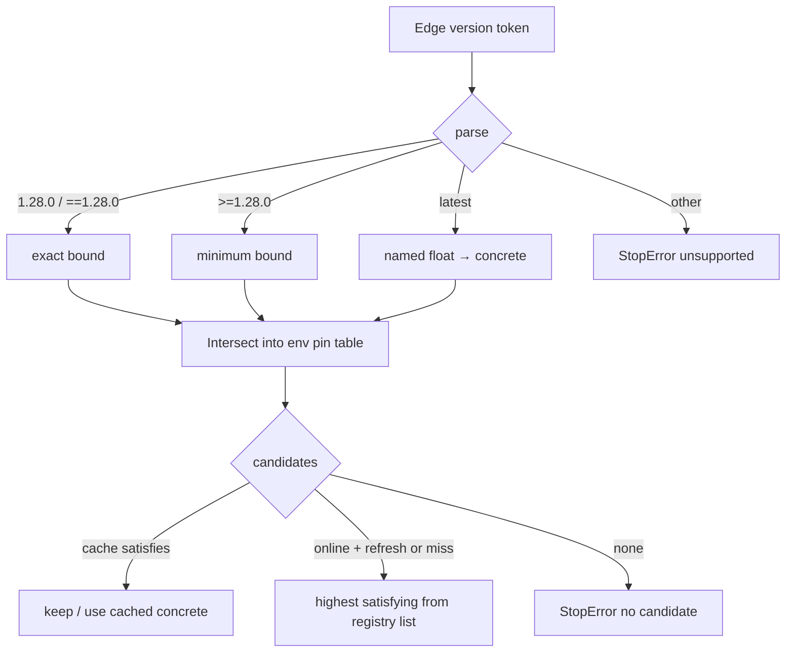
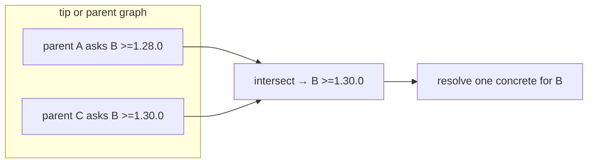

# Plan: GitLab package dependency version ranges

- **Status:** done
- **Related:** [`gitlab-package-transitive.md`](gitlab-package-transitive.md) (MVP concrete pins; was `gl-dep-ranges`); [`archive/package-build-publish-deps.md`](../archive/package-build-publish-deps.md) (open question 10 — floating `latest` ≠ constraint solver); [`archive/gitlab-package-latest.md`](../archive/gitlab-package-latest.md); ROADMAP Dependencies / packages; [#279](https://github.com/ja11sop/cuppa/issues/279)
- **Updated:** 2026-10-10
- **Impact:** minor — richer manifest / consume pins; existing exact-version edges stay valid
- **PR:** (this branch — soak: c_ares ``>=1.34.5`` → 1.34.8; tip list bound→concrete)

## Problem

Transitive GitLab MVP pins **concrete** versions in traveling manifests
(`cuppa-publish.json` / legacy `cuppa-dependency.json`). Publish may resolve
`latest` into a pin. Publishers often want a softer contract such as “need
package B at least 1.28.0” without republishing A for every B patch:

```json
{
  "name": "widget_core",
  "package": "widget-core",
  "version": ">=1.28.0",
  "registry": "same"
}
```

Today two concrete pins that disagree are a hard conflict
(`_ensure_registered` in `cuppa_dependency_apply`). Ranges need a clear resolve
+ diamond policy without becoming a full Conan- or pip-style solver (MVP
non-goal of the parent plan).

## Intent

1. Allow **exact** and **minimum** spellings on manifest edges **and** on
   consumer `package_dependency(..., version=…)`.
2. Keep **absent / exact** behaviour unchanged when no range is used.
3. Fail clearly when no cached or registry candidate satisfies the active
   bounds, or when two parents demand incompatible bounds on the same package
   identity.
4. Stay offline-friendly: prefer remembered / on-disk extracts that satisfy the
   bounds; no silent upgrade past cache without refresh or a new online resolve.

## Non-goals (not pip / not Conan)

People may imagine PEP 440 / `requirements.txt` richness. **We do not need that.**
This plan is a small bound grammar over GitLab generic-package versions only.

| Expectation (pip-like) | Cuppa MVP |
|------------------------|-----------|
| `>=1.28,<2` / comma lists | **No** — one bound token per edge |
| `~=1.28.0` compatible release | **No** — defer |
| `^1.28.0` / caret (npm-style) | **No** — defer |
| `!=1.29.0` exclusions | **No** |
| `1.28.*` wildcards | **No** |
| Pre-release ordering (`1.28.0a1`) as first-class | **No** — keep today’s sort-key behaviour; do not invent pep440 |
| Backtracking across the whole DAG | **No** — intersect bounds per identity, pick one concrete |
| Ranges on ConanCenter / non-GitLab | **No** |
| Replacing `latest` with a range | **No** — `latest` stays a named floating token (Q10); ranges are separate |

Supported MVP spellings:

| Spelling | Meaning |
|----------|---------|
| `1.28.0` | Exact (today) |
| `==1.28.0` | Exact (optional sugar; same as bare) |
| `>=1.28.0` | Minimum inclusive |
| `latest` | Unchanged named float → concrete via registry list + remember |

## Settled leans

| Topic | Settle |
|-------|--------|
| Consumer `package_dependency` | **Same grammar** as manifest edges from day one (one parser; tip + transitive share diamond intersect) |
| Publish | May write a range when the publisher declared one. Seed `latest` still becomes a **concrete** pin in the traveling artefact when that was the publish seed (Q10 unchanged) |
| Consume selection | Among candidates that satisfy **all** active bounds for `(registry, package)`: prefer on-disk / remembered if still satisfying; else highest from registry list (online). Offline: only cache / remembered |
| Diamond | **Intersect** bounds; empty intersection → `StopError` naming both parents |
| `--refresh-downloads` | Re-list / re-fetch may move to a **higher** satisfying version. Without refresh (and offline), keep the remembered extract if it still satisfies — no silent upgrade past cache |
| `--list-dependencies` | Show **bound on the edge**, **resolved concrete on the leaf** |
| Sort / compare | Reuse `package_version_sort_key` from `gitlab_latest` (dotted / underscored); do not pull in packaging/PEP 440 for MVP |

## Direction



Diamond (two parents → one identity):



## Examples (validate against need)

Use these as the acceptance stories. If a real publisher need is **not** covered,
extend the grammar deliberately — do not silently grow toward pip.

### 1. Exact edge (unchanged)

Manifest / consumer:

```text
version = "1.28.0"
```

Resolve: only `1.28.0`. Second parent asking `1.29.0` → conflict (today’s behaviour).

### 2. Minimum edge

```json
{
  "name": "widget_core",
  "package": "widget-core",
  "version": ">=1.28.0",
  "registry": "same"
}
```

Registry has `1.27.0`, `1.28.0`, `1.29.1`. Online resolve picks **`1.29.1`**.
Offline with only `1.28.0` cached → use `1.28.0`. Offline with only `1.27.0` → fail.

### 3. Optional `==` sugar

```text
version = "==1.28.0"   → same as "1.28.0"
```

### 4. Diamond: compatible minima

```text
A → B  version >=1.28.0
C → B  version >=1.30.0
```

Intersect → `B >=1.30.0`. Pick highest satisfying (e.g. `1.31.0`). One extract;
both parents BuildWith the same factory.

### 5. Diamond: exact ∩ minimum

```text
A → B  version 1.30.0
C → B  version >=1.28.0
```

Intersect → exact `1.30.0` (minimum does not loosen an exact pin). OK if
`1.30.0` exists.

### 6. Diamond: conflict

```text
A → B  version 1.28.0
C → B  version 1.30.0
```

Empty intersection → `StopError` naming A and C (and the two bounds). Same for:

```text
A → B  version >=1.30.0
C → B  version ==1.28.0   # 1.28.0 does not satisfy >=1.30.0
```

### 7. Tip consumer range + transitive exact

```python
# tip sconscript
B = cuppa.package_dependency( 'widget_core', registry=…, package='widget-core',
                              version='>=1.28.0' )
```

Traveling manifest from another package also asks `widget_core` `==1.29.0`.
Intersect → `1.29.0` if `>=1.28.0` allows it; else fail.

### 8. Publish: declare range vs seed `latest`

| Publisher seed | Traveling edge written |
|----------------|------------------------|
| `version=">=1.28.0"` on dependency BuildWith / manifest input | May keep `>=1.28.0` in publish JSON |
| `version="latest"` on dependency | Still pin **concrete** at publish (Q10) — not rewritten as a range |

Consumers of the published A then see either a soft bound or a frozen pin,
depending on what A’s author declared — not an accidental float from `latest`.

### 9. Offline vs refresh

```text
Bound:     >=1.28.0
Cached:   1.28.0
Registry: 1.28.0, 1.29.1
```

| Mode | Concrete used |
|------|----------------|
| Offline / normal online with cache hit that still satisfies | `1.28.0` (no silent bump) |
| `--refresh-downloads` (online) | may move to `1.29.1` |
| Offline, cache only `1.27.0` | fail — does not satisfy |

### 10. List display

Conceptual `--list-dependencies` shape (exact wording TBD in implementation):

```text
widget_util
└─ widget_core  >=1.28.0  →  1.29.1   (<registry>/widget-core/1.29.1/…)
```

Edge shows the **bound**; leaf / remark shows the **resolved concrete** extract.
Exact edges can omit the arrow or show `1.28.0 → 1.28.0`.

### 11. Unsupported spellings (refuse clearly)

```text
>=1.28.0,<2.0.0     StopError — unsupported version spelling
~=1.28.0            StopError — unsupported
^1.28.0             StopError — unsupported
>=1.28.0,!=1.29.0   StopError — unsupported
```

Message should point at the supported table (exact / `==` / `>=` / `latest`), not
suggest pip equivalence.

### 12. Identity keying

Bounds attach to the same identity the MVP already uses for pins: package
**BuildWith name** in the env pin table (today `_cuppa_package_version_pins`),
with registry resolved (`same` → parent). Two different registries that happen
to share a package slug stay separate factories — out of scope to merge them.

## Implementation sketch (later)

| Slice | Work |
|-------|------|
| A. Parse | Small helper: token → exact / minimum / latest / error; unit tests for examples 1–3, 11 |
| B. Pin table | Store bound sets (or normalised lower+optional exact) per name; intersect on `_ensure_registered`; conflict messages cite both parents |
| C. Select | Given bounds, choose concrete from cache / remember / registry list using `package_version_sort_key` |
| D. Publish path | Allow range through `normalise_dependency_entry` / fill; keep `latest` → concrete at publish |
| E. List | Edge bound + resolved concrete |
| F. Docs | Antora package / cascade notes; CHANGELOG minor |

Hooks today: `cuppa_dependency_manifest.normalise_dependency_entry` (requires
concrete string), `cuppa_dependency_apply._ensure_registered` (string equality),
`gitlab_latest.package_version_sort_key` / `list_generic_package_versions`.

## Progress

| Item | Status |
|------|--------|
| Split from transitive MVP | Done — this proposal |
| Settled leans + non-pip boundary | Done — examples revision |
| Worked examples (validate need) | Done — examples revision |
| A. Parse helper + unit tests | Done — `package_version_bound` |
| B. Pin-table intersect + parent conflict messages | Done — `cuppa_dependency_apply` |
| C. Select concrete (cache / remember / registry / refresh) | Done — `resolve_bound_to_concrete` + `default_version` |
| D. Publish / manifest path allows ranges | Done — `normalise_dependency_entry` |
| E. List ``bound → concrete`` | Done — tip defaults + requires edge + nest version rows |
| F. Antora + CHANGELOG | Done on this PR |
| Soak (c_ares publish 1.34.8 + grpc ``>=1.34.5``) | Done — soft keep of cache; ``--refresh-downloads=c_ares`` → 1.34.8; tip list ``>=1.34.5 → 1.34.8`` |
