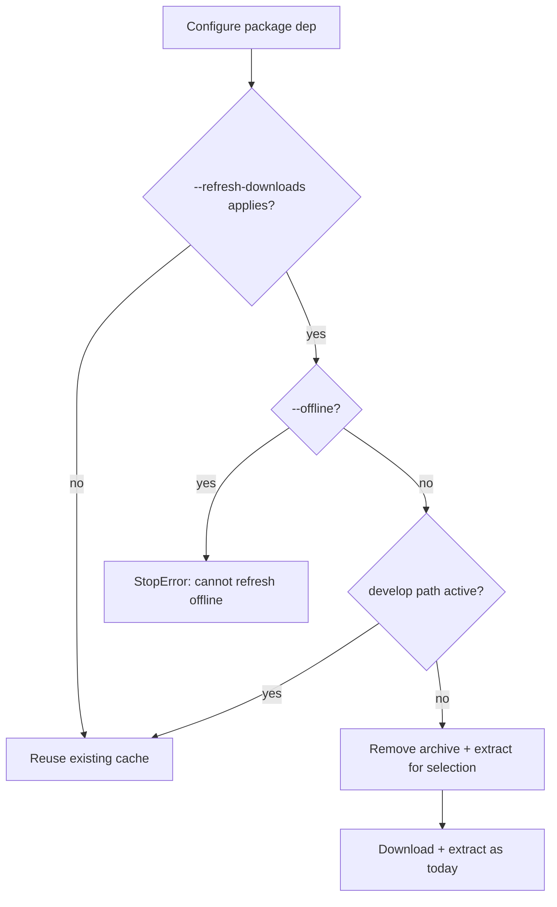

# Plan: Refresh package downloads after same-version republish

- **Status:** proposal
- **Related:** [#296](https://github.com/ja11sop/cuppa/issues/296); [`ROADMAP.md`](../../ROADMAP.md) — storage Planned (`package-download-refresh`); [`package-build-publish-deps.md`](package-build-publish-deps.md) (cascade publish must refresh after each upload); [`removal-options.md`](removal-options.md) (purge/wipe vocabulary); [`cmake-package-prefix.md`](../archive/cmake-package-prefix.md) § Prove-out soak; [`gitlab.py`](../../cuppa/package_managers/gitlab.py) `GitlabPackageDependency`
- **Updated:** 2026-09-14
- **Impact:** `minor` (new opt-in CLI behaviour)

## Problem

GitLab package **consume** caches by package name + version + toolchain/OS stem:

| Layer | Typical path shape | Skip condition today |
|-------|--------------------|----------------------|
| Archive | `downloads_root/packages/<pkg>/<ver>/<stem>.tar.gz` | File **exists** → never re-download |
| Extract | `dependencies_root/<tool_variant>/<pkg>/<ver>/` | `include/` **exists** → never re-extract |

There is **no** registry freshness check (no `HEAD` / `If-Modified-Since` / ETag).
`--offline` only refuses when the archive is missing; it does not validate currency.

**Soak pain (project D / google-cloud-cpp stack):** republish `protobuf/36.1`
(same version, new contents after rebuilding against Cuppa Abseil). A dependent
publisher (gRPC) that already has that archive + extract on disk keeps building
against the **old** bits. Cleaning the dependent’s `_build` does not help.
Operators must manually `--purge-dependencies=…` / `--wipe-dependencies=…`
(or delete cache paths) before the next online configure.

That workflow is correct but easy to forget mid-stack republish.

## Intent

Add an **opt-in** way to say: for this configure, treat declared package
dependencies’ cached archives (and their extracts) as stale — re-fetch from the
registry and re-extract — without requiring a separate purge/wipe dance.

Not a silent default. Not automatic GC ([`ROADMAP` storage-gc](../../ROADMAP.md)
out of scope). Complements purge/wipe; does not replace them.

## Current behaviour (authoritative)

From `GitlabPackageDependency` construction:

1. Resolve preferred/existing archive under `downloads_root/packages/…`.
2. If **not** `--offline` and archive path **missing** → download first available stem.
3. If extract `include/` **missing** and archive present → extract.
4. Else → `Using package […] from […]` (reuse extract as-is).

`--develop` with a develop path skips download/extract for that dependency.

Publish-side staging refresh (`staging_tree_needs_refresh` / #209) is **orthogonal**
— that refreshes publisher staging from a local install prefix, not consume caches.

## Naming options

Working title in conversation: `--refresh-dependent-downloads`. Explore before
locking CLI help.

| Candidate | Pros | Cons |
|-----------|------|------|
| `--refresh-dependent-downloads` | Matches the soak phrasing (“deps of this project”) | “Dependent” is ambiguous (transitive vs “downloads that are dependencies”); long |
| `--refresh-downloads` | Short; pairs with `--list-downloads` | Might sound like it refreshes **location** HTTP archives too |
| `--refresh-package-downloads` | Explicit GitLab/package scope | Longer; “package” vs Cuppa dependency **name** |
| `--refetch-packages` / `--re-download-packages` | Verb is unmistakable (force network) | “Packages” alone may confuse Conan / Boost source |
| `--update-package-downloads` | Parallel to `--update-develop` | “Update” suggests conditional/smart; we may force-replace |
| `--invalidate-package-cache` | Describes mechanism | Sounds like wipe-only; does not say “then fetch again” |
| `--refresh-dependencies` | Short | Collides mentally with remove/purge/wipe family; too broad |

**Provisional preference (settle before first implementation commit):**

- Flag name: **`--refresh-downloads`**
- Optional value: comma-separated Cuppa dependency **names**
  (`--refresh-downloads=protobuf,abseil_cpp`), empty/bare = all **project-used
  GitLab package** dependencies for this configure.
- Docs subtitle: “re-fetch package archives (and re-extract)”.

Rationale: keep the `--*-downloads` vocabulary next to `--list-downloads`; avoid
“dependent” jargon; scope in help text and Antora rather than in a longer flag.
If location-archive refresh is ever wanted, add a separate flag or a
`--refresh-downloads-scope=packages|locations|all` later — do not overload v1.

Refuse to ship under the provisional name if review prefers
`--refresh-package-downloads` for disambiguation; renaming before release is cheap.

## Proposed semantics (v1 sketch)

| Topic | Proposal |
|-------|----------|
| When | Configure-time, before BuildWith uses the package dirs |
| What | For each selected GitLab package dep: delete (or ignore) matching archive under downloads + matching extract under dependencies_root for the **current toolchain/variant selection**, then download + extract as today |
| Selection | Bare flag → all project-used GitLab package deps; `=LIST` → those names only (unknown name → clear error) |
| `--offline` | **Refuse** with a clear message (cannot refresh without network) |
| `--develop` | Skip refresh for deps that resolve via develop path (local tree is source of truth) |
| Location deps / Conan | Out of scope for v1 |
| Conditional vs force | **Force** re-download in v1 (simpler, honest for same-version overwrite). Optional later: HEAD/`Last-Modified` skip if unchanged |
| Interaction with purge/wipe | Refresh = “ensure currency for this build”; purge/wipe remain storage maintenance. Refresh may reuse the same path deletion helpers wipe already uses |
| Dry-run | Honour `-n` / dry-run if other storage actions do: report what would be re-fetched |

## Work slices

| ID | Deliverable | Target |
|----|-------------|--------|
| `pkg-dl-refresh-plan` | This plan + design README / ROADMAP pointer | **This change** |
| `pkg-dl-refresh-names` | Settle flag spelling + `=LIST` grammar in plan table | Before impl |
| `pkg-dl-refresh-impl` | Option + GitlabPackageDependency hook; unit tests | `minor` |
| `pkg-dl-refresh-docs` | Antora Managing / CLI inspect-and-maintain; soak note in cmake-package-prefix | Same PR as impl |
| `pkg-dl-refresh-conditional` | Optional If-Modified-Since / skip unchanged | Later |

## Acceptance

1. Same-version republish of package A, then configure project B with the refresh
   flag, yields A’s new archive contents under dependencies_root without a prior
   manual purge.
2. Without the flag, behaviour unchanged (existence-only cache).
3. `--offline --refresh-downloads` fails clearly.
4. Name list errors are actionable; bare flag does not touch unrelated downloads.
5. Antora documents the flag next to list/purge/wipe and warns about same-version
   republish soaks.

## Out of scope

- Changing default cache policy to always check the registry.
- Auto-refresh on every online build.
- Content-addressed archive filenames (would also fix the pain; larger change).
- Publish-side “bump version on every rebuild” policy (operator choice).
