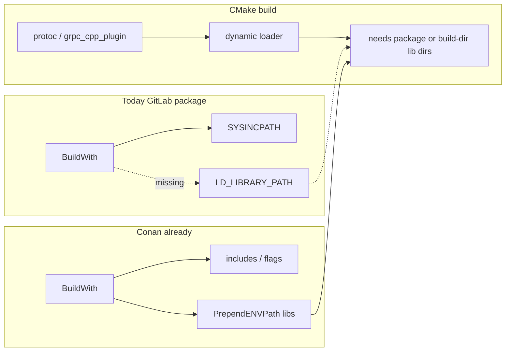

# Package runtime paths (GitLab + CMake publishers)

- **Status:** shipped
- **Related:** [`ROADMAP.md`](../../ROADMAP.md) — 1.11.0; [`cmake-drive-and-package-staging.md`](cmake-drive-and-package-staging.md) (`package-runtime-paths`); [`runtime_paths.py`](../../cuppa/package_managers/runtime_paths.py)
- **Updated:** 2026-09-13
- **Impact:** `minor` (new automatic consume-time ENV behaviour + publisher CMake helpers)

## Problem

Cuppa GitLab packages install shared libs under a non-system prefix
(`…/<variant>/grpc/1.84.0/lib`). Before this slice,
[`GitlabPackageDependency.initialise_build_variant`](../../cuppa/package_managers/gitlab.py)
only added `SYSINCPATH` (and modules). Conan already injected runtime search
paths (`LD_LIBRARY_PATH` / `DYLD_LIBRARY_PATH` / `PATH`); that logic now lives
in [`apply_package_runtime_paths`](../../cuppa/package_managers/runtime_paths.py)
and GitLab `BuildWith` uses it too.

That gap surfaces when **host tools** from a package run during a consumer
build (e.g. `grpc_cpp_plugin` → `libgrpc_plugin_support` + Protobuf
`libprotoc`), and again for `--test` / `--run` against shared package libs.
Hand-setting `env['ENV']['LD_LIBRARY_PATH']` in every publisher or consumer
sconscript works but should not be the product story.

A second, related failure shows up **inside** CMake publishers that set
`CMAKE_BUILD_WITH_INSTALL_RPATH` + `CMAKE_INSTALL_RPATH=$ORIGIN/../lib`: that
RPATH is correct for the **installed** `bin/` → `lib/` layout, but wrong for
the **in-tree** layout where `grpc_cpp_plugin` and `libgrpc_plugin_support.so`
are siblings under the CMake build dir. Codegen then fails with
`error while loading shared libraries: libgrpc_plugin_support.so…` even when
consume-time package paths are fine. Interim publisher fix: prepend the CMake
build dir (and dependency `lib/`) to `LD_LIBRARY_PATH` for `CMakeBuild`.

## Settled soak (done, private publishers)

Cuppa `opentelemetry-cpp` **1.28.0** with `WITH_STL=CXX17`, wired into
google-cloud-cpp ahead of Sid’s non-STL OTel on `CMAKE_PREFIX_PATH`.
google-cloud-cpp **3.7.0** builds cleanly. Do not re-litigate `-opentelemetry`
on `GOOGLE_CLOUD_CPP_ENABLE` — `__ga_libraries__` always enables the bridge
and bigtable links it.

## Settled approach

**1. Consume-time (primary, automatic)** — on `BuildWith` / transitive apply,
prepend each package’s `lib/` (and `bin/` on Windows) to the construction
`ENV`, reusing Conan’s platform split. Cross-package needs (plugin →
Protobuf libs) are covered when the consumer `BuildWith`s both (and
transitive `cuppa-dependency.json` pulls edges).

**2. Publish-time (artefact quality)** — publishers of shared libraries embed
`$ORIGIN/../lib` via `CMAKE_INSTALL_RPATH`. Own-package libs resolve after
install without ENV. Cross-package absolute RPATH is **not** Cuppa policy
(breaks relocatable caches / version bumps).

**3. Publisher build-tree vs install RPATH** — `cmake_install_rpath_defines`
must not blindly set `CMAKE_BUILD_WITH_INSTALL_RPATH=True` alone when the
build layout differs from install. Prefer either:

- `CMAKE_INSTALL_RPATH=$ORIGIN/../lib` for install, plus
  `CMAKE_BUILD_RPATH` that includes `$ORIGIN` (or the CMake build dir) for
  in-tree tools; or
- document that publishers which enable `BUILD_WITH_INSTALL_RPATH` must also
  ensure build-time loader paths (ENV or `CMAKE_BUILD_RPATH`).

Consume-time ENV does **not** replace this for the publisher’s own
in-progress CMake tree.

**Console:** ``cuppa.utility.command.run`` reprints matching failure lines after
a non-zero exit so parallel Ninja warning floods cannot hide ``FAILED:`` /
loader errors (landed in 1.11.0.dev alongside this plan).

**4. CMake helpers (thin convenience)** — `cmake_prefix_path(*dirs)`,
`cmake_install_rpath_defines(...)`. Do **not** make `CMakeConfigure` the only
place that sets `LD_LIBRARY_PATH`; graph methods inherit `env['ENV']` via
[`IncrementalSubProcess`](../../cuppa/output_processor.py).

**Out of scope for this slice:** embedding absolute `-Wl,-rpath,<cache>/lib`
on every `use_libs` link line; packaging OpenTelemetry (done privately).

## Implementation

### A. Shared runtime-path helper

- Extract or twin Conan’s `_apply_runtime_paths` into e.g.
  `cuppa/package_managers/runtime_paths.py` (new module):
  `apply_package_runtime_paths(env, lib_dirs=(), bin_dirs=())`.
- Call from Conan (refactor) and GitLab package dependency so behaviour
  cannot diverge.

### B. GitLab package apply

In `GitlabPackageDependency.initialise_build_variant` after `SYSINCPATH`:

- `apply_package_runtime_paths(env, lib_dirs=[self._lib_dir], bin_dirs=[…]`.
- Transitive `BuildWith` already walks edges; initialise always applies.

Idempotency: prepend without unbounded growth (dedupe path entries).

### C. buildsys.cmake publisher helpers

In [`cuppa/buildsys/cmake.py`](../../cuppa/buildsys/cmake.py):

- `cmake_install_rpath_defines(...)` — install `$ORIGIN/../lib`, and a
  build-tree-safe story (see settled approach §3).
- `cmake_prefix_path(*dirs)` → `;`-joined string.
- Document on Packages Antora: shared packages use the RPATH helper;
  consumers rely on BuildWith for runtime ENV; publishers that run
  in-tree plugins during `CMakeBuild` need build RPATH or ENV.

### D. Consumer / publisher cleanup (private trees, after Cuppa lands)

- Drop hand-rolled `LD_LIBRARY_PATH` from google_cloud_cpp once B ships.
- Drop hand-rolled CMake-build-dir `LD_LIBRARY_PATH` from grpc once C’s
  build-tree RPATH story lands (or keep a one-liner if helpers stay
  install-only).
- Republish protobuf/grpc/otel with major identity as needed.

### E. Plan / changelog / tests

- Slice on [`cmake-drive-and-package-staging.md`](cmake-drive-and-package-staging.md):
  `package-runtime-paths` (`minor`).
- Unit tests: helper prepends Linux/Darwin/Windows keys; GitLab
  `initialise_build_variant` mock sets `ENV`.
- CHANGELOG under open `1.11.0`; Antora note on Packages + GitLab consume.

## Verification

- Unit gate for new helper + dependency apply.
- Manual: google_cloud_cpp configure/build codegen without sconscript
  `LD_LIBRARY_PATH` once Cuppa `--develop` has the change.
- Manual: gRPC publisher codegen without build-dir `LD_LIBRARY_PATH` once
  build-tree RPATH helper lands (or confirm ENV still required and document).
- Confirm `cuppa --test` against a shared GitLab package still finds libs.

## Progress snapshot

| Item | State |
|------|--------|
| OTel STL package + cloud-cpp soak | Done (private) |
| Interim LD_LIBRARY_PATH in cloud-cpp / grpc publishers | **Removed** (Cuppa BuildWith + `cmake_install_rpath_defines`) |
| `apply_package_runtime_paths` + GitLab apply | **Done** (Conan refactored onto helper) |
| `cmake_*` RPATH / prefix helpers | **Done** |
| Docs / CHANGELOG / tests | **Done** |
| Private publisher ENV cleanup (D) | **Done** |
| gRPC `<algorithm>` glob.cc patch for old pins | **Removed** (history keeps it; pin stays on current release) |
