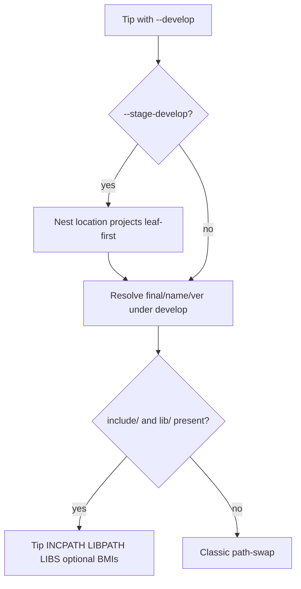

# Plan: `--stage-develop` for location dependencies

- **Status:** in progress
- **Related:** [`ROADMAP.md`](../../ROADMAP.md) — `stage-develop-locations`; [`package-develop-local.md`](package-develop-local.md) (package half of `--stage-develop`); [`package-build-publish-deps.md`](package-build-publish-deps.md) (cascade plan / topo precedent); [`build_with_location.py`](../../cuppa/build_with_location.py); [`develop.py`](../../cuppa/develop.py); [`location.py`](../../cuppa/location.py)
- **Updated:** 2026-09-20
- **Impact:** `minor` — new behaviour under an existing opt-in flag; location `--develop` alone unchanged

## Problem

After [`package-develop-local`](package-develop-local.md) slice D, `--stage-develop` is
**package-only**: it nest-builds publisher-shaped package `develop=` trees so the tip can
consume `final/<package>/<version>/`, and nest-cleans them with `-c`.

**Location** dependencies already have a coherent `--develop` story: swap the retrieved tree
for the operator's working copy, and the tip compiles against that copy (includes / sources in
the tip graph). There is no nest, and tip `-c` does not wipe the develop tree's own `_build`.

That leaves a useful gap. Operators often treat a location `develop=` path as "another Cuppa
project I am editing" and want the tip to nest-build those projects on demand.

## Shipped meaning (L1/L2/L3/L4)

| Mode | Flags | Location develop with sconstruct |
|------|--------|----------------------------------|
| Discover | `--develop` | Path-swap, **or** link `final/<name>/<ver>/{include,lib}` when that stage already exists |
| Plan | `--develop --stage-develop-plan` | Print leaf-first nest order; exit (no build/clean). |
| Stage | `--develop --stage-develop` | Nested project build/clean in leaf-first order; tip links a usable stage when present |

### Nested session (settled)

1. Nested `cuppa -D` via `tip_forward_args(..., project_only=True)`; drop `--stage-develop` /
   `--stage-develop-plan` (single-level).
2. Survey before tip sconscripts; banners show `N of M`.
3. **Order (nest execute):** leaf-first over edges from each candidate's `develop=` declarations
   (top-level sconstruct/sconscript) and `cuppa-publish.json` dependency names that intersect the
   **nestable** candidate set. Cycles refuse. Candidates with no edges keep a stable topo among
   isolates.
4. Nested env sets `PYTHONUNBUFFERED=1`.
5. Tip consumes a package-shaped stage when present ([L3](#l3-tip-consumes-staged-location-artefacts));
   otherwise path-swaps the checkout.
## Soak findings (matching_facility)

| Finding | Decision |
|---------|----------|
| Banner said `1 of 1: moo` then silence | Collect-then-run + `PYTHONUNBUFFERED` (L1/L2). |
| Expect `1 of 13` | Survey all location develops with an sconstruct. |
| `--parallel` / `--test` | Forward into each nest; nests stay sequential `1…N`. |
| Need cascade-style topo / plan? | **L4** — `--stage-develop-plan` + leaf-first order. |
| Plan should show broken deps in-place | L4 UX revision — interleaved `unstaged` nodes (below). |

## L4: `--stage-develop-plan` and ordered stage builds

| Requirement | Detail |
|-------------|--------|
| Flags | `--stage-develop-plan` requires `--develop`; does **not** require `--stage-develop`. |
| Side effects | None — develop-action early exit (same family as `--list-develop`). |
| Edge source (nest) | Among nestable candidates only. |
| Execute | `--stage-develop` uses leaf-first nestable order (unchanged by plan UX). |
| Non-goal | Parallel nested sessions across develops; changing nest refuse rules via the plan alone. |

### L4 plan report UX (settled 2026-09-20)

Closer to `--cascade-plan`: every location develop stays visible; judgements hang under the
node; a footer summarises nestable vs unstaged. Nest behaviour is **unchanged** — this slice
is report-shaped.

#### Vocabulary and counts

**Staging a location develop** (the `--stage-develop` flag) means running a **nested
project build** in that checkout — the same idea as a nest under cascade, scoped to
location `develop=` trees. Report copy says **will stage** / **unstaged** so it tracks
the flag name; “nest” appears only where it clarifies the mechanism (e.g. summary
parenthetical).

| Term | Meaning |
|------|---------|
| Considered | Every tip location `develop=` (packages excluded). |
| Will stage | Path is a directory with `sconstruct` / `SConstruct` — nest-built under `--stage-develop`; gets `K of M`. |
| Unstaged | Considered but will not be nest-built — tree marker `unstaged` (not an ordinal). |

| Number | Where |
|--------|--------|
| Intro subject | All considered (e.g. `13 location projects`) |
| `[E errors][W warnings][N notes]` | Sum of nested judgements under those nodes |
| `K of M` | Will-stage only (`M` = stage count); matches execute order |
| Summary | `M` will stage / `U` unstaged (+ reasons); `--clone-develop` once if any path missing |

#### Tree order

**Leaf-first execute order** for every row that will stage (`1 of M` … `M of M` top to
bottom). Unstaged rows follow that block (still in tip declaration order among
themselves). Declaration order is not used for the nestable list — execute order is
stable, matches `--stage-develop`, and can inform a better sconstruct layout.

#### Severity map

| Situation | Marker | Severity | Nested under node | Exit |
|-----------|--------|----------|-------------------|------|
| Develop path missing | `unstaged` | **error** | Short prose: path does not exist (no per-node `--clone-develop`) | 1 |
| Path exists, no sconstruct | `unstaged` | **warning** | Not an SCons project; will not nest; tip may still use files | 0 |
| Nestable, branch neither tip nor `main`/`master` (nor configured default/base) | `K of M` | **warning** | Branch deviates from expected set (tip + preferred default emphasised; other default plain info) | 0 |
| Nestable, not a git working copy | `K of M` | **note** | Expected a repository; can proceed with path only | 0 |
| Nestable, clean / modified / ahead / behind | `K of M` | (none) | State stays in muted `(host/org/repo@branch state)` only | 0 |
| Cycle among nestables / plan without `--develop` | — | hard stop | No tree | 1 |

Off-branch is a counted warning on a **nestable** node. No-sconstruct is **unstaged** + warning.
Do not conflate them.

#### Node chrome

- Command banner: emphasise `--stage-develop-plan` (info/bold) like `--develop`.
- Tip preamble: this project’s name + muted `(host/org/repo@branch …)` with the tip
  **branch** emphasised info (it anchors later off-branch warnings); one line on
  considered vs will-stage / unstaged counts.
- Parenthetical: observed checkout (`host/org/repo@branch state`); missing trees use
  `wants host/org/repo` from configured `location=` (keep a trailing `@` / `@rev` when the
  sconstruct declares it). Same short-name style throughout.
- Off-branch: warning colour on the branch token **and** a nested warning judgement.
  Expected-branch prose lists tip first (emphasised info), then the tip repo’s
  default from local `origin/HEAD` when known (else `--location-default-branch` /
  `master`, also emphasised info), then the other of `main`/`master` as plain info —
  e.g. `(feature_1 or master or main)` when the tip is on `feature_1` and default is
  `master`.
- `project […]` path in info; breathing stubs as today.
- `depends on […]`: edges among the **full considered name set** (including unstaged). Nestable
  names info; unstaged names coloured by that dependency’s severity (missing → error,
  no-sconstruct → warning). Plain words/brackets/commas; wrap between names.
- Unstaged nodes: cascade-style nested severity group (`1 error` / `1 warning`); no depends-on
  when the tree is missing (nothing to observe).

#### Footer

```
└── Stage plan summary
    ├── M projects will stage under --stage-develop (nested project build)
    └── U unstaged:
        │
        ├── name [path]
        …
        └── Use --clone-develop to obtain missing projects   # only if any missing
```

Replace the old `--stage-develop-plan: N planned; nothing was built…` chip with this summary; keep
a one-line “nothing was built or cleaned” note if useful beside the summary.

#### Explicit non-goals (this UX slice)

- Refusing `--stage-develop` nests for off-branch checkouts (plan warns only).
- Promoting `modified` / `N behind` into counted notes.
- Package develops in this tree (still the package stage path).

## L3: tip consumes staged location artefacts

**Status:** baseline implemented — C++ `include/` + `lib/` (+ optional `modules/`).
Example H (docs/assets) remains a follow-on.

### Why L3 exists

After L1/L2, `--stage-develop` nest-builds a location `develop=` tree (that project’s
own `_build` / `final/`). Without L3 the tip still **path-swaps** to the checkout and
compiles against it. Nesting and consuming were decoupled.

For **packages**, slice D already couples them: after stage, the tip links
`final/<package>/<version>/`. L3 gives location develops the same prefix consume when
a usable stage is present.

### Package D vs location (with L3 baseline)

| | Package `develop=` (D) | Location `develop=` (L1/L2/L4 + L3) |
|--|------------------------|-------------------------------------|
| `--develop` alone | Discover stage or StopError | Path-swap; **if** `final/<name>/<ver>/{include,lib}` exists, prefer that stage |
| `--develop --stage-develop` | Nest `--stage-package`; tip links stage | Nest project build; tip links stage when produced (e.g. via `StageLocationDevelop`) |
| What tip links | Prefix `include/` + `lib/` (+ `modules/`) | Same when stage present; else checkout includes / sources |
| Missing stage | StopError + hint | Path-swap (forgiving) |

### Example → coverage (baseline)

| Example | In baseline? | Tests / docs |
|---------|--------------|--------------|
| A — nest unused by tip | Fixed when producer stages | Integration: `test_location_stage_develop_tip_consumes_staged_prefix`; Antora develop tip-consume section |
| B — tip wants prefix | Yes | Same + `test_location_develop_discovers_existing_stage_without_nesting`; unit `resolve_develop_location_stage_*` |
| C — tip needs `.a` | Yes | Tip test links `hello_value()` from staged lib (same tip-consume integration) |
| D — header-only / no stage | Yes (must not break) | `test_location_stage_develop_without_prefix_keeps_path_swap`; docs “no usable stage → path-swap” |
| E — dual location+package | Enabled, not required | Docs: one location + stage replaces dual declare; no dedicated dual-declare test |
| F — clean then missing stage | Forgiving path-swap | Nest `-c` integration; missing stage → path-swap (unit + D-shaped nest without stage) |
| G — identity match | Prefer tip toolchain×variant path | Shared with package `resolve_develop_package_stage` (unit finds under identity path) |
| Modules BMIs (optional) | Yes | `test_location_stage_develop_tip_consumes_packaged_modules` (nest stages `modules/`; tip imports `math`) |
| H — docs assets | **Out of baseline** | Design only |

### Shapes operators actually hit (examples)

Use these as priority fuel. Map each to a real workaround in the assessment table;
generic names only (tip, location **L**, package **P**).

#### Example A — “I nest-build L so its tests/libs exist, but tip still recompiles L”

- Tip declares location **L** with `develop=`.
- Operator runs `cuppa -D --develop --stage-develop` so **L**’s nested session
  builds **L**’s libraries and maybe installs under **L**/`_build/…/final/…`.
- Tip build still compiles **L**’s sources (or headers that pull implementation) into
  tip objects / tip-static-lib members.
- **Pain:** double work; tip and nest can disagree on flags; nest product is unused by tip.
- **Workarounds seen in the wild:** run nest only for **L**’s own tests; never expect tip
  to reuse nest artefacts; accept longer tip builds.

#### Example B — “L is a Cuppa project that already installs a prefix; tip wants that prefix”

- **L**’s sconstruct already does `Install` / package staging into a stable
  `final/<something>/` (or a hand-maintained `include/`+`lib/` under the develop path).
- Tip wants the same consume story as a GitLab package: link the prefix, do not
  compile **L**’s `.cpp` in tip.
- **L3:** stage with `StageLocationDevelop` (or equivalent `final/<name>/<ver>/`
  layout); tip links the prefix. Dual location+package declarations are no longer
  required for that consume shape.
- **L3 fit:** high if the nest’s `final/` is already the intended interface.

#### Example C — “Mid-stack location: tip needs L’s `.a`, not L’s headers-as-sources”

- Tip → location **L** (library). **L** builds a static/shared lib in its own graph.
- With path-swap, tip may only add include paths and still expect `LIBPATH`/`LIBS` to
  come from somewhere else (manual `Append`, second BuildWith, or compiling listed
  sources into tip).
- **Workarounds:** tip `sconscript` hard-codes `LIBPATH` into **L**/`_build/…`; scripts
  that `cp` nest outputs into a known place; dual package+location declarations.
- **L3 fit:** high when the missing piece is “link nest product with the same
  toolchain×variant identity as tip”.

#### Example D — “Header-only (or header-dominant) location — nest is irrelevant to tip”

- **L** is mostly headers; nest build exists for **L**’s tests or examples only.
- Tip correctly wants path-swap includes; staged libs are empty or unused.
- **L3 fit:** low / must not break this. Path-swap remains the right default; L3 must
  be opt-in or gated on “stage exists and is the declared consume mode”.

#### Example E — “Same tree declared twice: location for edit, package for link”

- Working copy is both a location develop (for `--list-develop` / clone / branch
  hygiene) and a package develop (so tip links `final/…`).
- **Workaround:** two dependency entries or carefully mirrored `develop=` paths;
  operators remember which flag path is “real” for linking.
- **L3 fit:** medium–high — collapsing to one location declaration that can nest and
  then consume stage removes the dual story.

#### Example F — “Clean asymmetry”

- Tip `-c` with `--stage-develop` nest-cleans **L**’s build (L2).
- **Baseline:** after nest-clean, the stage is gone → tip path-swaps (forgiving),
  unlike package D’s StopError. A later `--stage-develop` rebuild recreates the
  prefix and tip links it again. Strict discover-or-fail remains a follow-on.

#### Example G — “Toolchain×variant mismatch fear”

- Nest built **L** with tip-forwarded `--dbg` / toolchain flags (L1). Tip links a
  stale `final/` from an older nest with different identity.
- **Today (path-swap):** less acute — tip rebuilds from sources under tip’s flags
  (still can skew if includes alone are used).
- **Under L3:** matching rules must be as strict as package stage discovery (same
  identity keys), or tip must refuse / rebuild nest rather than link the wrong
  prefix.

#### Example H — “Shared documentation asset tree: tip copies sources and rebuilds”

Observed shape (anonymised): tip **T** is a protocol product; location **D** is a
shared documentation Cuppa project (templates, SCSS, PlantUML config, guide
AsciiDoc). **D** has its own sconscripts that build HTML into `_artifacts` /
`final`. **T** declares **D** as a location `develop=` **without** `include=` /
libs — not a C++ dependency.

What **T** does today:

1. Path-swap to **D**’s checkout (`BuildWith('D').local_sub_path()`).
2. `copy_remote_to_local` selected globs (scss, `*.j2.asciidoc`, guide sources,
   plantuml cfg) into tip-local `_remote_*` folders.
3. Tip sconscripts that largely **mirror** **D**’s own guide pipelines re-run
   `CompileScss` / `AsciidocToHtml` and install into **T**’s `final_dir` /
   `_artifacts`.
4. Some tip guides are **not** pure mirrors: they inject tip-generated protocol
   reference content (tip C++ program + another location’s helpers) into templates
   that came from **D**.

| Sub-case | What tip needs from **D** | L3 (C++ `final/` prefix) fit | Better fit? |
|----------|---------------------------|------------------------------|-------------|
| Pure mirror guides (user/protocol guides copied wholesale) | Finished HTML/CSS/SVG **or** the same sources | Low as currently framed (not `include/`+`lib/`) | Nest **D**, then **install/copy nest artefacts** into tip `_artifacts` — an L3-*shaped* “consume nest product”, but product is docs output, not a link prefix |
| Tip-enriched guides (templates + tip-generated includes) | **Source** templates/assets from **D** | Poor — finished HTML from **D** lacks tip injection | Path-swap (or a thin “asset root” API) remains correct; copy_remote is the workaround for keeping tip build self-contained |
| Nest **D** under `--stage-develop` today | Builds **D**’s own guides; tip still copies sources and rebuilds | Classic Example A for non-C++: nest product unused by tip | |

**Workaround cost:** duplicated sconscripts; configure-time `shutil.copy2` outside
normal SCons dependency edges; tip rebuilds what **D** already knows how to build;
`--stage-develop` on **D** does not remove the copy/rebuild loop.

**Priority read:** this use case **motivates broadening** what “staged location
artefact” means (not only package-like `include/`+`lib/`), and/or a first-class
way to treat a location develop as an **asset root** without hand-rolled copy.
It does **not** by itself justify L3 as “link nest `.a` like package D”. Score the
pure-mirror sub-case as medium for a docs/asset L3 variant; keep tip-enriched
guides on path-swap.

### Workarounds → L3 replacement map (fill in soak)

When prioritizing, paste concrete operator habits into the left column (no private
host paths in this public plan — describe the shape).

| Workaround shape (today) | Cost / fragility | Would L3 replace it? | Priority note |
|--------------------------|------------------|----------------------|---------------|
| Dual declare: location **and** package on the same tree | Duplicate config; two mental models | Yes, if location can nest+link stage | |
| Tip `LIBPATH` / `LIBS` hand-pointed into **L**/`_build/…` | Breaks on identity / clean; not portable | Yes | |
| Copy nest `final/` (or `.a`) into a prefix tip already understands | Scripted drift; easy to forget `--stage-develop` | Yes | |
| Always build tip against sources; nest only for **L**’s own CI/tests | Wasted tip compile; fine for header-only | Only if tip should stop compiling **L** | |
| Migrate location → package dependency solely to get D’s stage consume | Loses location-only ergonomics if any | Yes (stay on location) | |
| Prefix-shaped `develop=` on a package entry (no sconstruct) | Legacy; fights publisher-shaped D | Partial — prefer publisher stage | |
| Tip `copy_remote_to_local` from location **D** + duplicated doc sconscripts (Example H) | Duplicate pipelines; nest of **D** unused; tip-enriched guides still need sources | Only for pure-mirror outputs, and only if L3 (or sibling) means “consume nest file artefacts”, not C++ prefix alone | Medium for docs/asset variant; path-swap stays for tip-injected guides |

*(Empty priority notes are intentional — fill during soak; promoting L3 needs at
least one high-cost row with a clear yes.)*

### Settled baseline (L3.0–L3.4)

**Status:** baseline implemented — C++ `include/`+`lib/` plus optional `modules/`;
Example H (docs assets) remains a follow-on.

| Question | Baseline choice |
|----------|-----------------|
| Scope | Classic headers + libraries; modules BMIs additive in the same prefix |
| Trigger | Tip consumes a stage **when present** (after nest or from a prior nest). No new flags. `--develop` alone path-swaps if no stage |
| Layout | `_build/<identity>/final/<dep_name>/<version>/` with `include/`, `lib/`, optional `modules/` (same as package D) |
| Version | `cuppa-publish.json` version if present, else `develop` |
| Missing stage | Path-swap (no StopError) |
| Producer | `env.StageLocationDevelop(name, libs, include_dir=…, version=…)` installs into that layout |



| Tip needs | On stage | Behaviour |
|-----------|----------|-----------|
| Includes | `include/` | `INCPATH` from stage |
| Libraries | `lib/` | `LIBPATH` + link discovered stems |
| Module BMIs | `modules/module-map.json` | `load_packaged_modules` if present — integration: `test_location_stage_develop_tip_consumes_packaged_modules` |

**Follow-ons (not baseline):** strict discover StopError like package D; Example H
docs/asset artefact consume; per-dependency opt-out flags.

### Explicit non-goals (baseline)

- Silently requiring every location develop to stage.
- Changing `--develop` alone to refuse without a stage.
- Docs/HTML / `copy_remote_to_local` replacement (Example H).
- Parallel nested sessions or package develops in the location plan tree.

## Slices

| Slice | Content | Impact |
|-------|---------|--------|
| L0 | Plan + ROADMAP | none — **shipped** |
| L1 | Nest location develops; survey + `N of M` | `minor` — **shipped** in [#313](https://github.com/ja11sop/cuppa/pull/313) |
| L2 | Nest `-c`; docs; unbuffered nested output | `minor` — **shipped** with L1 in [#313](https://github.com/ja11sop/cuppa/pull/313) |
| L3 | Tip consumes package-shaped location stage (`include/`+`lib/`+optional `modules/`) | `minor` — **baseline on this branch** |
| L4 | `--stage-develop-plan` + leaf-first ordered stage builds | `minor` — **this branch** / [#315](https://github.com/ja11sop/cuppa/pull/315) |
| L4b | Plan report UX: execute-order tree, `unstaged` judgements, stage=nest vocab | `minor` — **this branch** |

## Success criterion (L4)

- `cuppa -D --develop --stage-develop-plan` — prints the plan; no nests; no `_build` under develops.
- `cuppa -D --develop --stage-develop` — nests nestable trees in leaf-first order.
- Plan shows every considered location develop; unstaged stay visible; `[E]/W]/N]` matches nested judgements.

## Success criterion (L3 baseline)

- Location develop that stages `final/<name>/<ver>/{include,lib}` is consumed from that prefix when present; tip does not rebuild those sources.
- Optional `modules/module-map.json` under the stage is loaded for BMIs.
- No stage → path-swap unchanged.
- No new CLI flags.

## Relationship to package D

| | Package publisher `develop=` | Location `develop=` with sconstruct |
|--|------------------------------|-------------------------------------|
| `--develop` | Discover package stage / fail with hint | Path-swap; if a location stage already exists, prefer it (forgiving) |
| `--develop --stage-develop` | Nest `--stage-package`; tip links stage | Nest project build; tip links stage when produced |
| `--develop --stage-develop-plan` | (n/a — package stage has no separate plan yet) | Report order + unstaged judgements; exit |
| Clean with `--stage-develop` | Nest clean | Nest clean |
| Tip consume after nest | Links stage (D) | Links stage when `include/`+`lib/` present (L3) |

One flag family: **discover by default, stage when asked, plan when reviewing;** location tip
consume matches package D’s prefix shape when a stage exists.
